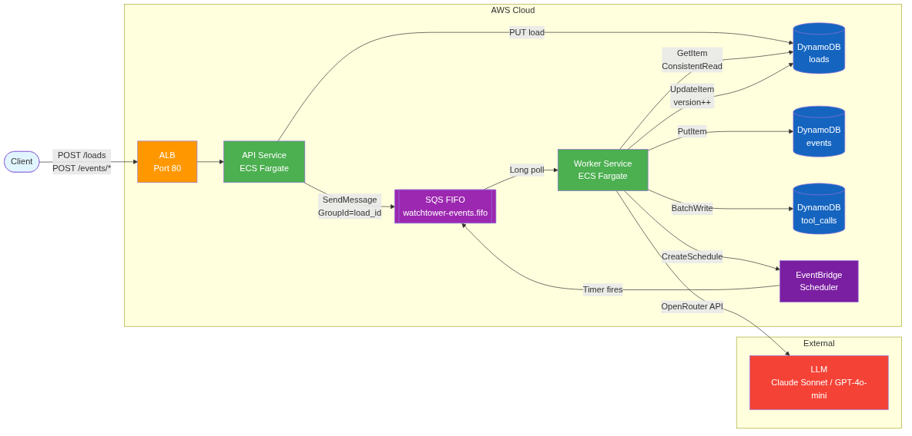
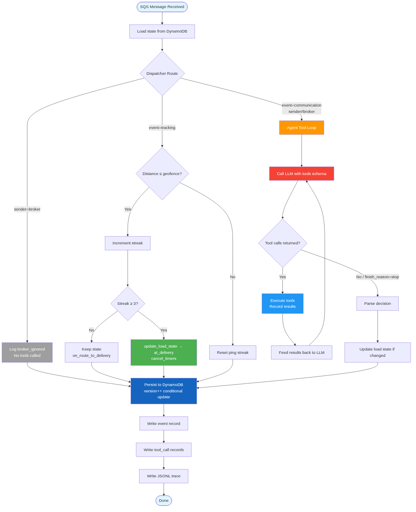
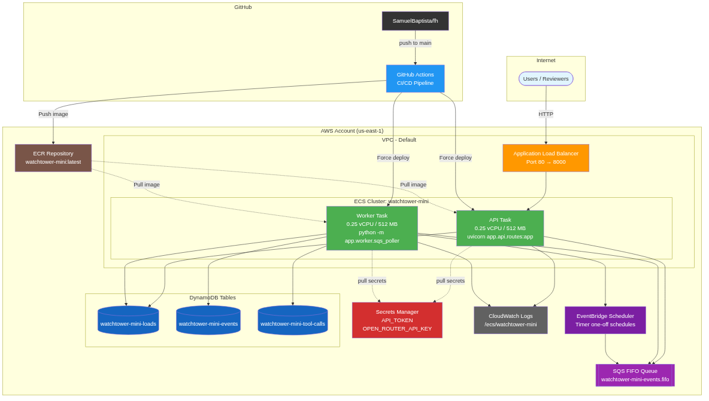

# Watchtower Mini — Delivery Document

## Submission Summary

### 1. GitHub Repository
https://github.com/SamuelBaptista/fh

### 2. Deployed Public API
```
Base URL: http://watchtower-mini-alb-1307411393.us-east-1.elb.amazonaws.com
Auth:     Authorization: Bearer fh-eval-token-2026
```

### 3. How to Run Locally
```bash
# Option A: Docker (recommended — full stack with LocalStack)
cp .env.example .env   # add your OPEN_ROUTER_API_KEY
make up                # starts API + Worker + LocalStack
curl http://localhost:8000/health

# Option B: Direct (no queue, dev server only)
uv sync --all-extras
make run
```

### 4. How to Run Evals
```bash
make eval                   # Mock mode (fast, no API key needed)
LLM_MODE=live make eval     # Live mode (all 8 cases, needs OPEN_ROUTER_API_KEY)
```

### 5. Trace / Log Evidence
- `runs/evt-*.jsonl` — JSONL tool call records from live eval run (committed)
- `runs/deployed-run-evidence.log` — captured deployed run output (committed)
- `make logs` — fetches latest CloudWatch logs (requires AWS credentials with access to the deployment account)

### 6. Architecture & Tradeoff Write-Up
- `docs/architecture.md` — full write-up
- `docs/diagrams/` — rendered architecture diagrams

### 7. AI Usage
- `docs/AI_USAGE.md`

---

## Architecture



**Stack**: FastAPI + SQS FIFO + ECS Fargate + DynamoDB + EventBridge Scheduler + OpenRouter

**Key insight**: Hybrid routing — deterministic Python for exact rules (broker filter, geofence math, channel match), LLM only for ambiguous classification and message drafting. Reduces cost, improves reliability.

### Cloud Resources

| Resource | Purpose | Cost |
|----------|---------|------|
| ECS Fargate (×2) | API + Worker services, 0.25 vCPU / 512 MB | ~$7/10 days |
| ALB | Public HTTP endpoint | ~$5.50/10 days |
| SQS FIFO | Per-load event ordering | Free tier |
| DynamoDB (×3) | loads, events, tool_calls | Free tier |
| EventBridge Scheduler | Timer follow-ups | Free tier |
| Secrets Manager | API_TOKEN + OPEN_ROUTER_API_KEY | ~$0.80/mo |
| ECR | Container images | ~$0.03/mo |
| CloudWatch | Structured JSON logs | ~$0.10/mo |

---

## Event Processing



### Deterministic Path (no LLM)
- **Broker messages**: immediately ignored, no action
- **Tracking pings**: geofence distance check, streak counter, 3 consecutive → arrival

### Agent Path (multi-turn tool loop)
- LLM receives: SOP + customer policy + event + load data + session context
- LLM calls tools (OpenAI function-calling format) → we execute → feed results back → repeat
- Typically 2-3 API calls per event, 4-10s total

---

## Customer-Specific Behavior

Customer policy as typed YAML in `app/config/customers/`. Add a customer = add a file.

| Area | Customer A | Customer B | Customer C |
|------|-----------|-----------|-----------|
| Geofence | 1 mile | 2 miles | 3 miles |
| ETA timer | 30 min | 60 min | 45 min |
| Escalation | Email | Slack | Email + Slack |
| POD validation | Automatic | Human review | Automatic |
| Lumper handling | Review task | Review task | Forward email to broker |

---

## Eval Results

**8/8 visible test cases pass** with live LLM.

| Case | Type | What It Tests |
|------|------|---------------|
| 3b | Agent | Driver asks address → reply with info |
| 3c | Agent | Missing info → task + slack notification (customer_b) |
| 3d | Agent | Truck breakdown → create_issue + acknowledge |
| 3f | Agent | ETA provided → update_eta + timer |
| 3h | Deterministic | 3 tracking pings → state=at_delivery |
| 3i | Agent | Driver says arrived → state transition + first arrival msg |
| 3j | Agent | POD attachment → check + state=pod_collected |
| 3k | Deterministic | Broker email → no action |

### How to Run Evals

**Option 1: Local (no Docker, fastest for development)**
```bash
# Install deps
uv sync --all-extras

# Mock mode — deterministic cases pass, agent cases xfail (no API key needed)
make eval

# Live mode — all 8 pass (~2 min, requires OPEN_ROUTER_API_KEY in .env)
LLM_MODE=live make eval
```

**Option 2: Docker (full stack with LocalStack — mirrors production)**
```bash
# Start all services (API + Worker + LocalStack)
make up

# Wait for health check
curl http://localhost:8000/health

# Run eval against docker-compose endpoint
LLM_MODE=live API_URL=http://localhost:8000 make eval

# Stop
make down
```

**Option 3: Against deployed endpoint**
```bash
# Run eval against live AWS deployment (no AWS credentials needed — just OpenRouter key)
LLM_MODE=live API_URL=http://watchtower-mini-alb-1307411393.us-east-1.elb.amazonaws.com make eval

# Fetch CloudWatch logs as trace evidence (requires AWS credentials for the deployment account)
make logs
```

---

## Observability

Every event produces structured JSON logs answering: **"Why did the agent call these tools for this event?"**

```json
{"msg":"event.received","load_id":"load-001","event_id":"evt-001","event_type":"inbound_communication","customer_id":"customer_a"}
{"msg":"event.dispatched","branch":"agent_required","requires_agent":true}
{"msg":"llm.complete","model":"anthropic/...","tokens_in":2500,"tokens_out":215,"duration_ms":4563}
{"msg":"agent.decision","intent":"load_information_question","branch":"Load Information Question","reasoning":"Driver asking for delivery address..."}
{"msg":"event.processed","branch":"Load Information Question","new_state":"on_route_to_delivery","tool_count":1}
```

Trace artifacts: `runs/evt-*.jsonl` (one file per event with full tool call records).

---

## Deployment



- **IaC**: Terraform in `infra/terraform/`
- **CI/CD**: GitHub Actions — lint → test → eval → build → ECR push → ECS deploy → smoke test
- **Secrets**: AWS Secrets Manager (never in env vars or code)
- **Single Dockerfile**: same image for local dev and cloud

---

## Design Decisions & Tradeoffs

| Decision | Why | Tradeoff |
|----------|-----|----------|
| ECS Fargate over Lambda | Better for multi-turn tool loops (10s+ execution), simpler container story | ~$13/10 days vs $0 idle Lambda |
| SQS FIFO MessageGroupId=load_id | Guarantees per-load ordering | 300 msg/s per group cap (fine for eval) |
| DynamoDB conditional update | Optimistic concurrency safety net under FIFO | Belt + suspenders |
| Hybrid routing | Deterministic = bulletproof for evals; LLM only for ambiguous | More code paths to maintain |
| Customer YAML | Add customer = add file, no code change | New policy axes need schema update |
| OpenRouter multi-provider | Real fallback between Anthropic → OpenAI | Single point of failure at OpenRouter |

---

## What I Would Do Differently With More Time

1. **Stale tracking timestamp check** — currently only distance, not freshness
2. **Timer end-to-end test** — timer fires → re-enters worker → processes follow-up
3. **Prompt versioning** — track prompt versions in traces for A/B comparison
4. **CloudWatch dashboard** — latency, error rate, model usage metrics
5. **Rate limiting** — per-customer API rate limits
6. **Multi-turn session replay** — richer context window for complex follow-up chains

---

## Quick Test Commands

```bash
# Health check
curl http://watchtower-mini-alb-1307411393.us-east-1.elb.amazonaws.com/health

# Seed a load
curl -X POST http://watchtower-mini-alb-1307411393.us-east-1.elb.amazonaws.com/loads \
  -H "Authorization: Bearer fh-eval-token-2026" \
  -H "Content-Type: application/json" \
  -d '{"load_id":"test-1","customer_id":"customer_a","load_data":{"external_load_id":"FH-1","companies":{"broker":{"name":"B"},"shipper":{"name":"S"},"carrier":{"name":"C"}},"contacts":{},"stops":[{"stop_id":"p1","type":"pickup","address":{"line_1":"123 St","city":"Chicago","state":"IL","postal_code":"60601","country":"US"},"appointment":{"type":"fixed","timezone":"America/Chicago"},"coordinates":{"lat":41.8,"lng":-87.6}},{"stop_id":"d1","type":"delivery","address":{"line_1":"456 St","city":"Dallas","state":"TX","postal_code":"75201","country":"US"},"appointment":{"type":"fixed","timezone":"America/Chicago"},"coordinates":{"lat":32.7,"lng":-96.8}}]},"initial_state":"on_route_to_delivery"}'

# Send tracking ping
curl -X POST http://watchtower-mini-alb-1307411393.us-east-1.elb.amazonaws.com/events/tracking \
  -H "Authorization: Bearer fh-eval-token-2026" \
  -H "Content-Type: application/json" \
  -d '{"event_id":"trk-1","event_type":"tracking","load_id":"test-1","customer_id":"customer_a","occurred_at":"2026-05-26T15:00:00Z","tracking":{"tracking_id":"t1","lat":32.77,"lng":-96.79,"distance_to_delivery_miles":0.5,"ping_sequence":1,"provider":"test"}}'
```
